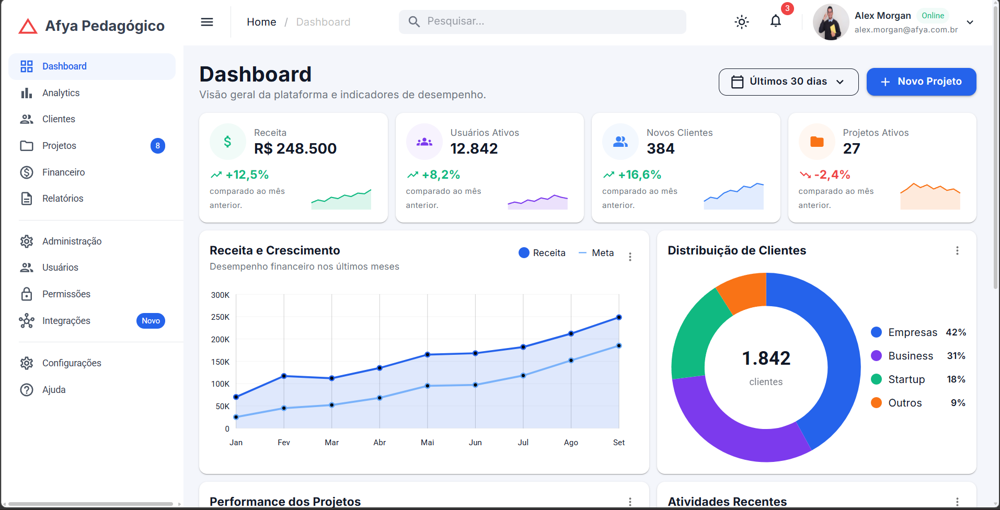
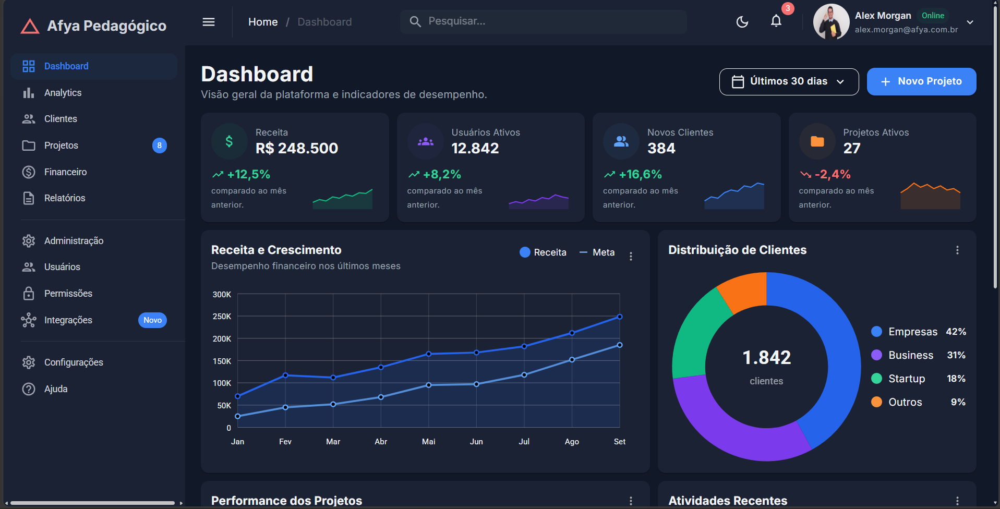
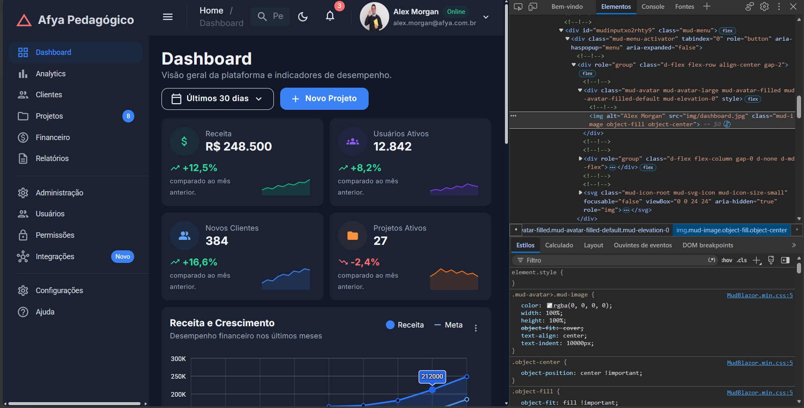

# Afya Admin — Dashboard com Blazor WebAssembly e MudBlazor

## Identificação

| | |
|---|---|
| **Aluno(a)** | Ricardo Amorin Machado Junior |
| **Matrícula** |  |
| **Faculdade** | São Lucas |
| **Curso** | Ciência da Computação |
| **Disciplina** | Programação web |
| **Professor(a)** | Liluyoud |
| **Semestre** | 2026.2 |

## Objetivo do projeto

O projeto consiste no desenvolvimento de um dashboard administrativo utilizando Blazor WebAssembly e MudBlazor. A aplicação apresenta uma interface moderna para visualização de informações administrativas, utilizando componentes reutilizáveis e recursos de responsividade.

O objetivo principal foi aplicar na prática os conceitos apresentados durante a disciplina, trabalhando com componentes Blazor, layouts, páginas, dados, parâmetros e componentes da biblioteca MudBlazor.

Além da construção da interface, o projeto também busca demonstrar a organização de uma aplicação Blazor e a utilização de componentes reutilizáveis para facilitar a manutenção e evolução do sistema.

## Tecnologias utilizadas

- .NET 10
- C#
- Blazor WebAssembly
- MudBlazor
- HTML5
- CSS3

## Como executar

### Pré-requisitos

É necessário ter instalado:

- .NET SDK 10.0 ou superior compatível com o projeto
- Git

### Clonar o projeto

```bash
git clone https://github.com/RicardoAmorin/afya-admin.git
cd afya-admin
```

### Restaurar as dependências

```bash
dotnet restore
```

### Executar o projeto

```bash
dotnet watch
```

Após iniciar, o terminal informará o endereço local para acessar a aplicação no navegador.

## Telas

### Tema claro



### Tema escuro



### Versão mobile


### HTML gerado (DevTools)



Ispecionei a imagem do dashboard, pois tive um pequeno problema com ela.

## Estrutura do projeto

```text
afya-admin/
├── Components/
├── Data/
├── Layout/
├── Pages/
├── wwwroot/
├── App.razor
├── Program.cs
└── README.md
```

### Principais pastas

- **Components** — contém componentes reutilizáveis utilizados na interface.
- **Data** — contém os modelos e estruturas de dados utilizados pelo dashboard.
- **Layout** — contém a estrutura de layout da aplicação.
- **Pages** — contém as páginas da aplicação.
- **wwwroot** — contém arquivos estáticos, como imagens, CSS e outros recursos.

## Componentes criados

| Componente | Responsabilidade | Parâmetros que recebe |
|---|---|---|
| `DashboardCard` | Componente reutilizável para organizar diferentes seções do dashboard. | Título, conteúdo e menu |
| `KpiCard` | Exibe indicadores e informações resumidas de desempenho. | Título, valor, variação, ícone e cores |
| `SeletorPeriodo` | Permite selecionar o período utilizado no dashboard. | `Valor`, `ValorChanged` |
| Outros componentes | Componentes utilizados para estruturar e apresentar as informações do dashboard. | Conforme implementação |

## O que aprendi

### 1. Como uma aplicação Blazor WebAssembly inicia no navegador?

Uma aplicação Blazor WebAssembly começa pelo `index.html`, que contém a estrutura inicial da página e o elemento `<div id="app">`, onde a aplicação será renderizada. O `Program.cs` é responsável por configurar e iniciar a aplicação, registrando os serviços e componentes necessários. Depois que o Blazor é carregado no navegador, ele utiliza esse espaço para renderizar os componentes da aplicação.

### 2. Qual é a diferença entre Layout, Page e Component?

O **Layout** define uma estrutura compartilhada entre várias páginas, como menus, cabeçalhos e áreas principais da aplicação. Uma **Page** representa uma tela específica que pode ser acessada por uma rota. Já um **Component** é uma parte reutilizável da interface que pode ser utilizada em diferentes páginas. Neste projeto, por exemplo, o `DashboardCard` é um componente reutilizável utilizado para organizar diferentes informações do dashboard.

### 3. O que é um RenderFragment?

`RenderFragment` permite passar conteúdo de interface para dentro de um componente. No `DashboardCard`, esse recurso permite que diferentes conteúdos sejam inseridos dentro do mesmo componente, evitando a necessidade de criar vários componentes praticamente iguais.

### 4. Como funciona o `@bind-Valor` no `SeletorPeriodo`?

O `@bind-Valor` permite manter sincronizado o valor selecionado no componente com a variável utilizada pela página. O `ValorChanged` é responsável por notificar o componente pai quando o valor é alterado, permitindo que a aplicação reaja à mudança.

### 5. Por que os dados ficam na pasta `Data`?

Os dados ficam separados dos componentes para melhorar a organização do projeto e separar a lógica dos dados da interface. Dessa forma, se futuramente os dados passarem a ser obtidos de uma API, será possível alterar a origem dos dados sem precisar modificar toda a estrutura visual dos componentes.

### 6. Como o `MudGrid` com `xs`, `sm` e `lg` funciona?

O `MudGrid` permite criar layouts responsivos. Os valores `xs`, `sm` e `lg` definem como os componentes devem ocupar espaço de acordo com o tamanho da tela. Dessa forma, os cards podem aparecer em diferentes quantidades por linha em celulares, tablets e computadores.

### 7. Como foi possível estilizar a página sem escrever CSS?

O MudBlazor fornece um sistema de temas e diversas classes utilitárias que permitem definir cores, espaçamentos, tamanhos, alinhamentos e outros aspectos da interface. O `MudTheme` permite configurar características visuais gerais da aplicação, enquanto as classes utilitárias facilitam a estilização diretamente nos componentes.

### 8. Por que o namespace do projeto é `afya_admin` e não `afya-admin`?

O hífen (`-`) não é permitido em identificadores utilizados pelo C#. Por isso, o nome `afya-admin` utilizado como nome de pasta ou projeto pode ser representado no namespace como `afya_admin`, utilizando o sublinhado.

## Dificuldades e soluções

### Problema 1 — Organização dos componentes

Durante o desenvolvimento, uma das dificuldades foi organizar os elementos do dashboard de forma que partes semelhantes da interface pudessem ser reutilizadas.

A solução foi criar componentes reutilizáveis, como o `DashboardCard`, permitindo utilizar a mesma estrutura para diferentes partes da página e alterar apenas o conteúdo apresentado.

### Problema 2 — Responsividade

Outra dificuldade foi fazer com que os elementos do dashboard se adaptassem corretamente a diferentes tamanhos de tela.

A solução foi utilizar os componentes de grid e as propriedades responsivas disponibilizadas pelo MudBlazor, como `xs`, `sm` e `lg`.

### Problema 3 — Execução e ambiente de desenvolvimento

Durante o desenvolvimento também ocorreram problemas relacionados à execução da aplicação, incluindo conflitos de porta e configurações do ambiente HTTPS local.

Esses problemas foram solucionados verificando os processos em execução e ajustando o ambiente de desenvolvimento para que a aplicação pudesse ser iniciada normalmente.

## Melhorias futuras

Como melhorias futuras, seria possível integrar o dashboard com uma API para utilizar dados reais, implementar autenticação de usuários, adicionar filtros mais avançados e conectar os indicadores a um banco de dados.

Também seria possível melhorar a experiência em dispositivos móveis e adicionar novas páginas administrativas, aumentando a quantidade de funcionalidades disponíveis no sistema.

---

## Autor

**Ricardo Amorin Machado Junior**

Ciência da Computação — São Lucas

Projeto desenvolvido para fins acadêmicos.